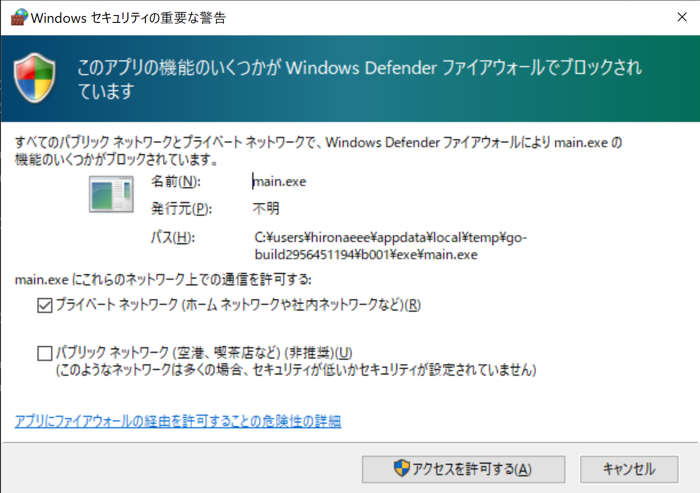

# ログインMockを作成

## 目的

React Native (Expo)とGoによるアプリケーションの作成

## やったこと

### Goについて

```
mkdir mock-api
cd mock-api
go mod init mock-api
# ルーティング用モジュールをインストール
go get github.com/gorilla/mux

### main.goを編集 ###
```

**参考にしたサイト**  
main.goのベース  
[Go言語で理解するJWT認証 実装ハンズオン](https://qiita.com/po3rin/items/740445d21487dfcb5d9f)  
HTTPリクエストの処理  
[Example to handle GET and POST request in Golang](https://www.golangprograms.com/example-to-handle-get-and-post-request-in-golang.html)

### React Native (Expo)について

```
expo init mock-client -t expo-template-blank-typescript
cd mock-client

### App.tsxを編集 ###
```

**参考にしたサイト**  
App.tsxのベース  
[Common React Native App Layouts: Login Page](https://code.tutsplus.com/tutorials/common-react-native-app-layouts-login-page--cms-27639)

### APIとクライアントの動作確認

```
# API
cd main.goがあるフォルダ
go run main.go
# クライアント (別のPowershellを起動)
cd App.tsxがあるフォルダ
expo start
# Androidを選択
```

デモの様子


`go run main.go`でGoサーバーを起動するたびに  
以下の警告が出るので「アクセスを許可する」を選択します。


## 残課題

- 入力内容のバリデーション
- API側のエラー処理を追加
- React Nativeの設定ファイルについて調査(tsconfig.json, prettierrc.js)
- Goで使用する追加ライブラリについて検討
- `go mod init`とは?
- Goのgitignore対象ファイルを調査